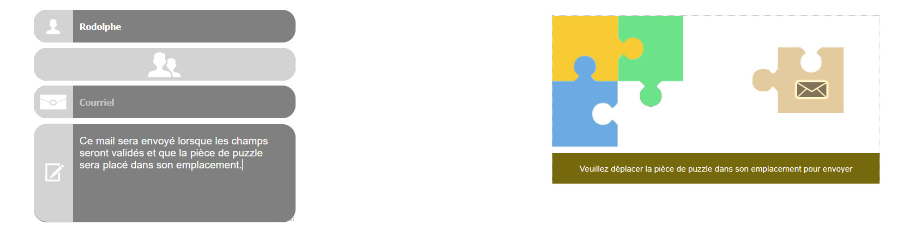

# mail
## Mail with a human verification system

### **The inputs**
The inputs Firstname, LastName, Email are hidden by a div displaying a picture centered. When the mouse come over, this div is reduced to show the input with its placeholder.

If the user move the mouse outside the input's area without having written something in, the input is hidden to show only the picture.

For the Textarea, it works the same except the fact the textarea is widened.

### **The puzzle**

To submit the mail, you have to move the puzzle piece and place it into the puzzle to complete it. Once completed (2 px offset from the exact place), the form is submitted.

* for now the contents isn't verified, some check tests in jquery with some patterns and css are necessary before submitting the form